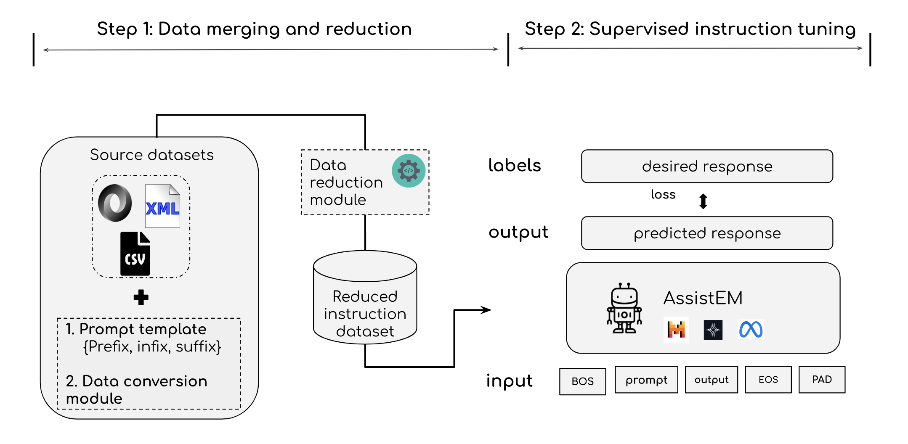

# AssistEM: Domain Instruction Tuning for Enhanced Entity Matching

abstract 

Closed-source LLMs like ChatGPT have gained prominence for natural language tasks, including Entity Matching (EM), without requiring task-specific architectures. However, open-source LLMs, including Meta’s LLaMA series and models such as SOLAR and Yi, offer viable alternatives, albeit often requiring fine-tuning for optimal performance. This paper explores Domain Instruction Tuning (DIT), a fine-tuning method using domain-specific data, for EM. We evaluate models from 7B to 34B parameters on an EM instruction-tuning benchmark, introducing a novel data reduction pipeline that enhances training efficiency without compromising F1 scores. Our results show that Yi-34b, with 122.8M trainable parameters, surpasses pre-trained models including Ditto and HierGAT, achieving an F1 score 6.9 points higher than GPT-4-0613 across seven tasks and outperforming all GPT-3 class models on two of three unseen benchmarks in zero-shot settings.

Repository contains code for [AssistEM: Domain Instruction Tuning for Enhanced Entity Matching](https://pakdd2025.org/call-for-paper-llm/) accepted in PAKDD conference 2025.



## Requirements

```
python install -r requirements.txt
```

## Datasets

We use eight real-world benchmark datasets with different structures from [Machamp](https://github.com/megagonlabs/machamp) , [Geo-ER](https://github.com/PasqualeTurin/Geo-ER) also used in the 
[PromptEM paper](https://arxiv.org/abs/2207.04802) and some DeepMatcher benchmarks.

## Fine-tuning


```
python3 finetune.py --base_model_path 'Deci/DeciLM-7B' --train_data_path 'dataset_path' --batch_size 32  --accum_grad_step 1 --epoch 3  --lr 3e-4 --lr_scheduler 'cosine' --peft_type 'LoRA' --linear_layers --use_gradient_checkpointing  
```

## Evaluation
 
```
python3 evaluate.py --method 'zero-shot' --test_data_path 'dataset_path' --base_model_path 'Deci/DeciLM-7B' --peft_path 'checkpoint/LoRA_deci' --incontext_data_path 'dataset_path' 
```


## Data reduction 

example usage;

```
python reduction_algorithm/dataset_reduction_algorithm.py --dataset train-full.json --num_clusters 10
```